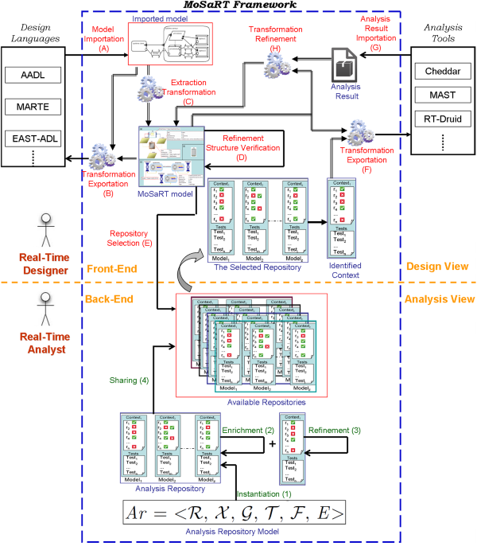

# MoSaRT: Modeling oriented Scheduling analysis of Real-Time systems


*MoSaRT* (_Modeling oriented Scheduling analysis of Real-Time systems_) is a model-based framework for design and analyze real-time systems. The underlying idea behind this proposal is to fill the gap between the academic real-time scheduling theory community and industrial practices. Since real-time systems need to be analyzed at an early stage of the development life-cycle in order to check if all the timing requirements are met, one of the main difficulties that the system designers face is to find the appropriate analysis tests helping to validate and/or to dimension properly their designs.Actually, research results have been exploited in industrial contexts only to a modest extent to date.

On the one hand, *MoSaRT provides a graphical design language* which is compliant with standard ones and which leads to get accurate design. One the other hand, *MoSaRT also provides an analysis repository model* playing the role of a storage of research studies enabling researchers to promote their works (e.g. analysis models, schedulability analysis, dimensioning tests), then to increase the applicability of the real-time scheduling analysis.



This page describes how to prepare an execution of MoSaRT.

## Software requirements

* Java version >= 7
* An integrated development environment (i.e. Eclipse: https://eclipse.org/downloads/)
* All operating systems that support at least the Java 7 version

## Download

*MoSaRT System* can be downloaded:

```console
$ git clone git@github.com:lias-laboratory/mosart.git
```

The repository contains of the following plugins:

* fr.ensma.mosartproject.analysisrepository
* fr.ensma.mosartproject.analysisrepository.edit
* fr.ensma.mosartproject.analysisrepository.editor
* fr.ensma.mosartproject.modelinglanguage
* fr.ensma.mosartproject.modelinglanguage.design
* fr.ensma.mosartproject.modelinglanguage.edit
* fr.ensma.mosartproject.modelinglanguage.editor
* fr.ensma.mosartproject.modelinglanguage.wizard

## Install and configure Eclipse

* Download an *Eclipse Modeling Tools* distribution (http://www.eclipse.org/downloads/)

* Open Eclipse application and choose the workspace directory you've created previously

* Go to the menu Help, open _Install Modeling Components_ menu item

* Install the following plugins dependencies:
  * OCL

  * SIRIUS

  * EEF

* Select _File => Import_ menu item

* Select _Existing Projects into Workspace_ item

* On the _Select root directory_ field, fill the complete path of the current workspace directory

* From _Projects_ list, select the projects and click on *Finish*

## Execute MoSaRT

* Select the _modelinglanguage_ plugin

* Open the context menu, select _Run As => Run Configurations..._ menu item

* Create a new Eclipse Application launch configuration

* Choose a specific name and click on the *Run* button

## Publications

### Conferences

* Yassine OUHAMMOU, Emmanuel GROLLEAU, Michael RICHARD, Pascal RICHARD, Frédéric Madiot, MoSaRT Framework : a Collaborative Tool for Modeling and Analyzing Embedded Real-Time Systems, Complex Systems Design & Management (CSDM'2014), edited by Springer Verlag, 2014.
* Yassine OUHAMMOU, Emmanuel GROLLEAU, Jérôme Hugues, Mapping AADL models to a repository of multiple schedulability analysis techniques, 16th IEEE International Symposium on Object/component/service-oriented Real-time distributed Computing (ISORC 2013), edited by IEEE, 2013.
* Yassine OUHAMMOU, Emmanuel GROLLEAU, Michael RICHARD, Pascal RICHARD, Reducing the gap between Design and Scheduling, 20th International Conference on Real-Time and Network Systems, edited by ACM, Nancy, France, edited by ACM, Novembre, 2012.
* Yassine OUHAMMOU, Emmanuel GROLLEAU, Michael RICHARD, Pascal RICHARD, Model Driven Timing Analysis for Real-Time Systems, The 9th IEEE International Conference on Embedded Software and Systems (ICESS), edited by IEEE, Liverpool, UK, June, 2012.

### Thesis

* Yassine OUHAMMOU, Model-based Framework for Using Advanced Scheduling Theory in Real-Time Systems Design, Thesis, ISAE-ENSMA, december, 2013.

## Historic Contributors

* [Emmanuel GROLLEAU](https://www.lias-lab.fr/members/emmanuelgrolleau)
* [Yassine OUHAMMOU](https://www.lias-lab.fr/members/yassineouhammou)